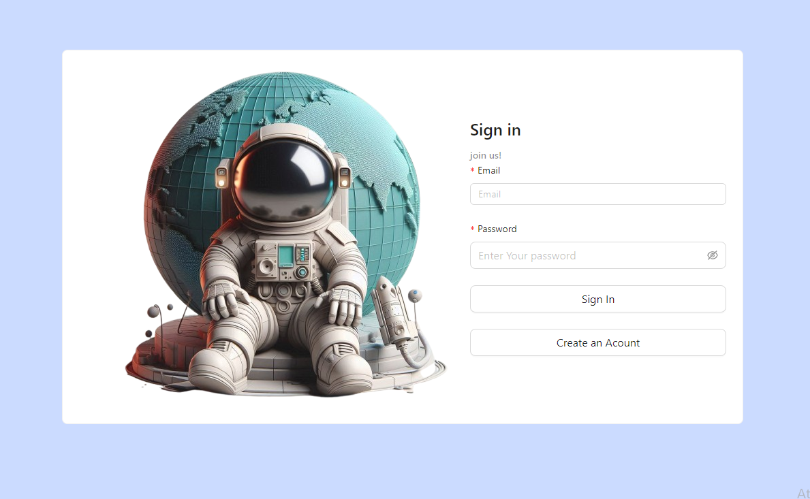
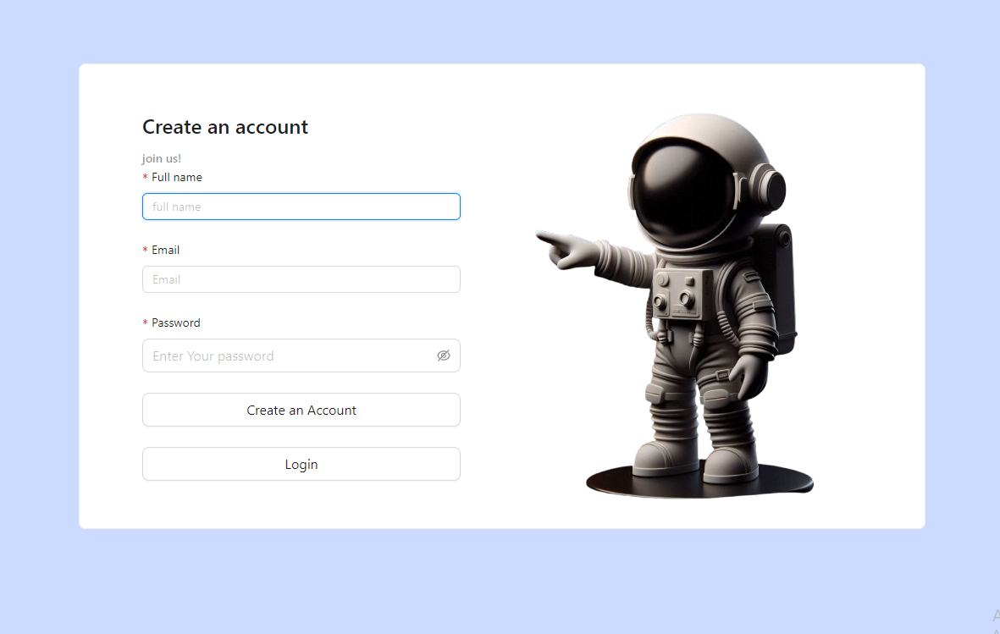
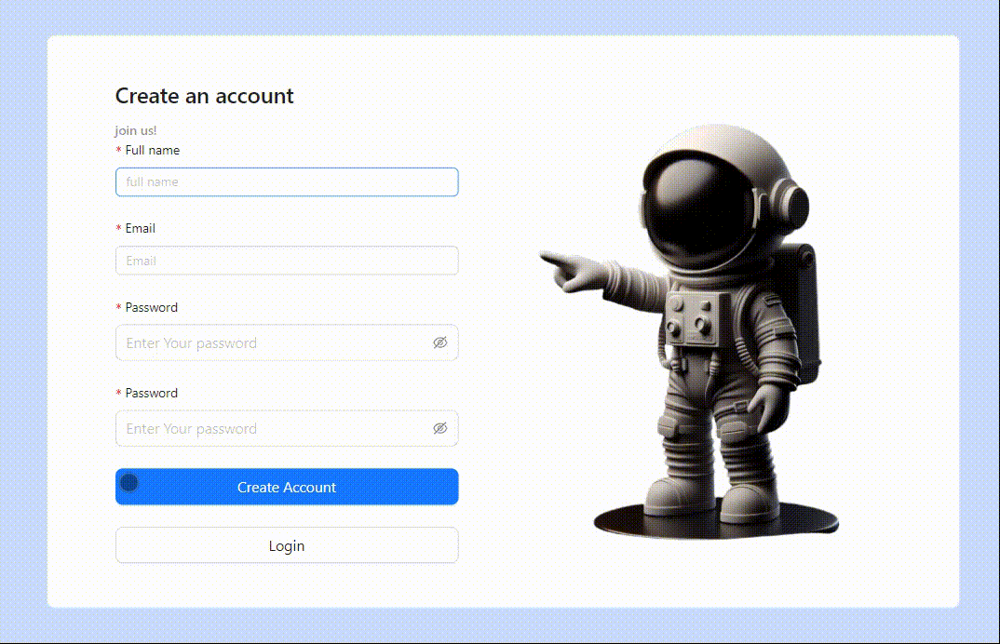

# Login System with ReactJS, NodeJS, and MongoDB

## Description
This project is a login system developed using ReactJS for the frontend, NodeJS for the backend, and MongoDB as the database. It uses the `bcrypt` library for password encryption, ensuring secure user authentication.



## Features
- User registration with password validation.
- Login for existing users.
- Password encryption in the database using `bcrypt`.
- User authentication with JWT (JSON Web Token).

## Technologies Used
- **Frontend**: ReactJS
- **Backend**: NodeJS (Express)
- **Database**: MongoDB
- **Authentication**: JWT (JSON Web Token)
- **Encryption**: bcrypt


## Requirements
- Node.js installed on the machine.
- MongoDB running locally or hosted on a service provider.
- Updated web browser.

## Working



## Installation
1. Clone the repository:
   ```bash
   git clone https://github.com/your-username/your-repo.git